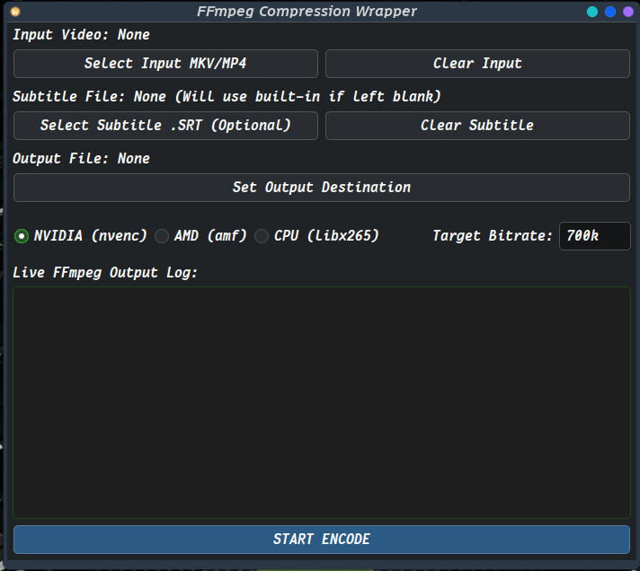
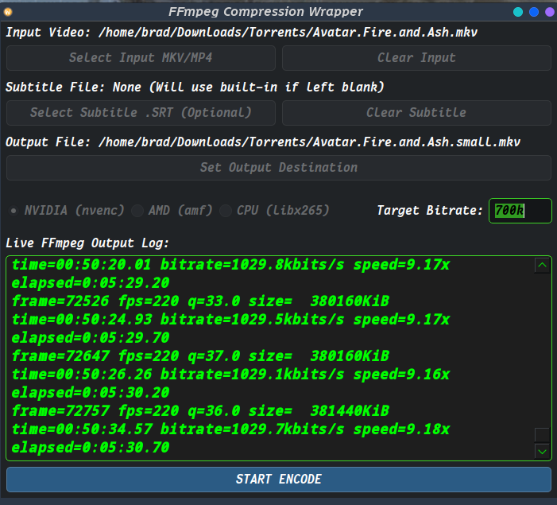

# This is a KDE wrapper for ffmpeg

## Requirements

- **FFmpeg**: The core command-line tool for the encoding.
  - **Arch-based:** `sudo pacman -S ffmpeg`
  - **Debian/Ubuntu-based:** `sudo apt install ffmpeg`
- **PyQt6**: The GUI toolkit for the application.
  - `pip install PyQt6`

---

- I had to make an adjustment, my original script converted media files to `*.mkv` but it seems that **KDE** has a bug
- KDE and `*.mkv` files the duration or length of media is not shown, I switched the output to `*.mp4` it still combines the `*.srt` + `*.mp4 | *.mkv`
- So when you encode it still does the same thing, stitching the subtitles to the media

<!-- markdownlint-disable-next-line MD033 -->
 

---

## Installation & Setup

1. **Clone the repository:**

```bash
git clone https://github.com/Bradford1040/qt6-encoder ~/qt6-encoder
```

Open your terminal and run this command to create the file:

```bash
nano ~/.local/share/applications/ffmpeg-encoder.desktop
```

- Paste the following block into Nano. Make sure to change the `/path/to/` directory on the `Exec=` line to wherever you actually have the main.py file saved (e.g., /home/"user-name"/qt6-encoder/main.py).

```bash
Ini, TOML
[Desktop Entry]
Type=Application
Name=FFmpeg Encoder
GenericName=Video Compressor
Comment=Custom GUI Wrapper for FFmpeg HEVC Encoding
Exec=python /path/to/your/main.py
Icon=video-x-generic
Terminal=false
Categories=AudioVideo;AudioVideoEditing;
```

Save and exit (Ctrl+O, Enter, Ctrl+X).

Because Plasma dynamically monitors that folder, it should instantly appear in your KDE Application Menu under the Multimedia category. If you type "FFmpeg Encoder" into your KRunner or application search bar, it will pop right up, completely detached from the terminal.

## Command Line for extracting subtitles, I might add this into GUI/Wrapper but still undesided

### 1. Extract the Subtitles from MP4 or MKV

- Rip the embedded subtitle track out of the MP4 or MKV and save it as an `.srt` file. You use `-map 0:s:0` to target the first subtitle track.

```bash
ffmpeg -i your_movie.mp4 -map 0:s:0 extracted_subs.srt
```

### 2. Edit in Gaupol Application

- **If you need to install Gaupol:**

- ARCH Based is `yay -S gaupol`
- Debian/Ubuntu Based is `sudo apt install gaupol -y`

- Open `extracted_subs.srt` in Gaupol, apply your `+/-0.000`  **Shift** ---> **File** ---> **Save-As** (e.g., `fixed_subs.srt`).

### 3. Replace the Old Subs in the MP4

- Now, we take the original video/audio tracks from your MP4.
- Grab the new subtitle track from your fixed `.srt`, and multiplex them together into a brand new MP4 container.

- The `-c copy` flag is critical here—it tells FFmpeg to just copy the video and audio bit-for-bit without touching your encode.

```bash
ffmpeg -i your_movie.mp4 -i fixed_subs.srt -map 0:v -map 0:a -map 1:s -c copy -c:s mov_text fixed_movie.mp4
```

- **What this command does:**

- `-i your_movie.mp4 -i fixed_subs.srt`: Loads both inputs.

- `-map 0:v -map 0:a`: Grabs the video and audio from the first input (the original MP4).

- `-map 1:s`: Grabs the subtitle track from the second input (the fixed SRT).

- `-c copy`: Copies the video and audio streams exactly as they are (instant process).

- `-c:s mov_text`: Converts the SRT back into the MP4-compatible `mov_text` format on the fly.

- Once `fixed_movie.mp4` spits out, verify the sync, and you can delete the original and the temp subtitle files.

### Use Gaupol app to adjust time sub shows

- Open `*.srt` file, either press **Tools** ---> **Shift Positions** | Just press keyboard shortcut H
- Adjust time to desired & press **Shift** then ---> **Save**

### 1. Core Styling Tags (Modified HTML Tags for sub's)

- SubRip (`.srt`) files use a strict, lightweight subset of standard HTML tags for inline styling.
- Because subtitle parsers vary across media players (like MPV, VLC, or Haruna).
- Sticking to basic inline tags guarantees your formatting will render correctly.

- The four most universally supported tags require an opening tag and a corresponding closing tag:

- **Italics** (used for off-screen speech, thoughts, or foreign words):

  ```plaintext
  <i>This is spoken off-screen.</i>
  ```

- **Bold** (used for heavy emphasis):

  ```plaintext
  <b>Listen carefully!</b>
  ```

- **Underline**:

  ```plaintext
  <u>Important text</u>
  ```

- **Strikethrough**:

  ```plaintext
  <s>Mistaken text</s>
  ```

### 2. Font Coloring

- You can inject specific colors using standard hex codes or color names wrapped in a font tag:

```plaintext
<font color="red">This text will be red.</font>
<font color="blue">This text will be blue.</font>
<font color="green">This text will be green.</font>
<font color="white">This text will be white.</font>
<font color="yellow">This text will be yellow.</font>
<font color="#55aaff">This text will be #55aaff.</font>
```

- **(Note: Some minimalist video players strip out custom colors, but modern players running on MPV/QtAV handle hex codes reliably).**

### 3. Combining Tags

- Tags can be nested inside one another, but you **must close them in reverse order** (LIFO: Last-In, First-Out), exactly like proper HTML:

```plaintext
<b><i>This text is both bold and italicized.</i></b>
```

- **(Incorrect nesting like `<b><i>text</b></i>` can break the parser and cause the raw tags to display on screen).**

### Anatomy of a Complete `.srt` Block

- If you are manually adding or fixing a missing line in an SRT file, each entry follows this exact layout:

```plaintext
12
00:01:23,456 --> 00:01:26,789
<i>Wait, did you hear that?</i>
<b>It came from the basement.</b>
```

- **Line 1:** The sequential index number.

- **Line 2:** The exact timestamp (`Hours:Minutes:Seconds,Milliseconds --> Hours:Minutes:Seconds,Milliseconds`). Note the comma separating seconds and milliseconds.

- **Line 3+:** The text payload (including any HTML formatting tags and line breaks).

- **Trailing Line:** Every single block **must** be followed by a blank line to separate it from the next sequence.
